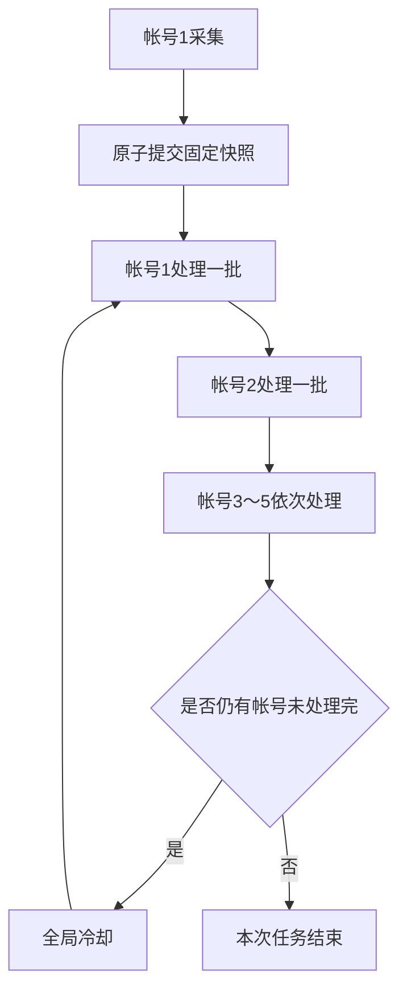

# AutoScript

- [AutoScript](#autoscript)
  - [本 Fork 的增强功能](#本-fork-的增强功能)
    - [多帐号共享采集与轮转参与](#多帐号共享采集与轮转参与)
    - [轮转配置](#轮转配置)
    - [固定快照与断点恢复](#固定快照与断点恢复)
    - [412 软熔断](#412-软熔断)
    - [专栏与新版 Opus 兼容](#专栏与新版-opus-兼容)
    - [青龙部署注意事项](#青龙部署注意事项)
  - [操作步骤](#操作步骤)
    - [获取COOKIE](#获取cookie)
      - [扫码登陆](#扫码登陆)
      - [手动获取](#手动获取)
    - [本地运行](#本地运行)
      - [可执行文件](#可执行文件)
      - [以源码方式运行](#以源码方式运行)
    - [Docker](#docker)
    - [青龙面板](#青龙面板)
  - [检测中奖](#检测中奖)
    - [检测未读信息, 已读未读信息](#检测未读信息-已读未读信息)
    - [中奖推送](#中奖推送)
  - [设置说明](#设置说明)
    - [评论验证码识别](#评论验证码识别)
    - [其他](#其他)
  - [Awesome](#awesome)

[Github仓库链接](https://github.com/shanmiteko/LotteryAutoScript)

[](https://github.com/shanmiteko/LotteryAutoScript/actions/workflows/pkg.yml)

[](https://github.com/shanmiteko/LotteryAutoScript/actions/workflows/docker.yml)

[](https://github.com/shanmiteko/LotteryAutoScript/actions/workflows/mirror.yml)

## 本 Fork 的增强功能

> [!IMPORTANT]
> 本仓库基于上游 [shanmiteko/LotteryAutoScript](https://github.com/shanmiteko/LotteryAutoScript)，以下内容描述本 Fork 增加的青龙多帐号运行、风控降载和专栏兼容功能。

### 多帐号共享采集与轮转参与

启用轮转模式后，不再让五个帐号分别重复搜索同一批动态：

1. 帐号1读取配置中的专栏、UID、标签等来源，只负责采集并生成本轮固定快照。
2. 采集阶段不关注、评论、点赞、转发或预约。
3. 参与阶段帐号1～5都只读取同一份 `lottery_info_1.json`。
4. 每个帐号每轮最多成功参与 `lottery_batch_size` 条，然后切换到下一个帐号。
5. 所有仍有待处理候选的帐号完成一轮后，统一休息 `lottery_round_cooldown`。
6. 不限制总轮数，直到每个帐号都处理完整份快照；已经处理完的帐号不会进入下一轮。
7. 可选的 `CollectionUIDs` 来源会固定读取指定UP的2页动态，只展开最近 `collection_dynamic_max_age_hours` 小时内的疑似合集，并从Opus正文链接中批量提取动态ID。



这里的“7条”是每轮批次大小，不是每日总上限。例如固定快照中有 50 条且五个帐号都可正常参与时，每个帐号最多分 8 轮处理，前 7 轮结束后各有一次全局冷却，最后一轮处理余下 1 条。

预约抽奖也会延后到参与阶段并计入批次，不会在筛选阶段一次性预约全部候选。预约接口返回 `75003`（活动已结束）时会直接跳过评论、关注、点赞和转发，并记录该候选避免下轮重复处理。

启用AI评论时，筛选固定快照不会再为全部候选提前调用AI。每个帐号只在候选真正进入当前批次时生成评论；同一动态会比较已成功发布评论的字符相似度，不再只检查完全重复。默认最多重试2次，仍不合格时使用低相似自然短评。模型会优先遵守明确的评论口令，否则生成2～15字短评，并拒绝复述群号、链接、进群或购买引导及表情符号。

成功发布的AI评论保存在 `comment_history/successful_comments.json`，默认保留30天，因此任务重启后仍能避免不同帐号在同一动态下使用相似句式。可通过 `ai_comment_retry_count`、`ai_comment_similarity_threshold`、`ai_comment_history_days` 和 `ai_comment_short_max_length` 调整；历史读取或保存失败只记录警告，不会中断参与流程。

### 轮转配置

在 `my_config.js` 的 `default_config` 中设置：

| 配置项 | 推荐值 | 说明 |
| --- | ---: | --- |
| `enable_lottery_round_robin` | `true` | 启用帐号1采集、所有帐号轮转参与 |
| `lottery_batch_size` | `7` | 每个帐号每轮最多成功参与的条数，不是总上限 |
| `lottery_round_cooldown` | `15 * 60 * 1000` | 一整轮结束后的全局休息时间，单位毫秒 |
| `collection_dynamic_max_age_hours` | `48` | 只展开最近多少小时内发布的合集动态 |
| `create_dy` | `false` | 不额外发布随机动态 |

帐号1的独立配置需要开启 `save_lottery_info_to_file`，帐号2～5可保持 `LotteryOrder: [3]`。轮转参与阶段程序也会强制所有帐号只读取帐号1的固定快照，避免重复搜索。

合集UID来源使用 `LotteryOrder` 编号 `5`。相关设置统一放在 `my_config.js` 的 `default_config`、普通 `UIDs` 配置之后：填写 `CollectionUIDs: [UID1, UID2]`，用 `collection_uid_scan_page` 自定义每个UID读取页数（默认2），用 `collection_dynamic_max_age_hours` 限制合集发布时间（默认最近48小时），用 `collection_dynamic_keywords` 自定义合集关键词；关键词设为 `[]` 时检查这些UID的所有近期原创动态。发布时间缺失或超出窗口的合集不会读取正文。单页返回 `-352` 时按 `collection_uid_page_352_cooldowns`（默认5/10/20秒）只重试当前页，最终失败会把本轮标记为采集不完整并拒绝覆盖固定快照。默认采集顺序为 `[2, 5, 0, 1, 3]`。

合集Opus网页正文连续读取失败时，会改用动态详情JSON提取正文节点和跳转链接；两条线路都失败会将本轮标记为采集不完整，不覆盖上一份完整快照。无效、空值或为 `0` 的动态ID不会进入共享候选。

话题来源使用 `LotteryOrder` 编号 `1`，现已切换到新版话题接口。推荐使用显式Topic ID，例如 `TAGs: [{ id: 1267572, name: '互动抽奖活动' }]`；字符串配置只采用完全同名的搜索结果，不会自动选择相似话题。`tag_scan_page` 表示每个话题最多读取的总页数，并按最新动态排序。

帐号之间原有的 `WAIT` 仍然生效。实际总耗时由候选数量、每条参与间隔、帐号切换间隔、全局冷却次数和网络重试共同决定。不要在上一轮尚未结束时再次启动同一个定时任务。

### 固定快照与断点恢复

- 帐号1先写入 `lottery_info_1.next.json`，完整扫描结束后再原子替换 `lottery_info_1.json`。
- 新快照只包含本轮采集结果，不会混入上一次扫描的旧候选。
- 替换前的有效文件保存为 `lottery_info_1.last-good.json`。
- 如果本轮没有得到任何有效候选，会保留上一份文件，但中止本轮参与，避免误用旧快照。
- 每个帐号继续使用独立的 `dyids/dyid*.txt` 保存处理进度；任务中断后，下次运行会跳过已经处理的动态。
- 每次到达批次边界前都会等待当前帐号的 `dyid` 写入完成，再切换帐号。
- 某帐号收到 B 站评论错误 `12014`（达到当前发送上限）后，立即暂停该帐号本轮：当前候选不记为已处理，也不继续关注、点赞或转发。帐号会保留到下一轮重新尝试；如果仍为 `12014`，再次暂停到再下一轮，其他帐号不受影响。

### 412 软熔断

动态详情或专栏正文接口连续出现 HTTP 412 时，继续逐条请求只会制造更多失败。本 Fork 增加了进程级共享软熔断，并为专栏搜索提供独立的渐进冷却：

- 连续 10 次相关 B 站请求返回 412 后开启熔断。
- 默认冷却 10 分钟，冷却期间停止 UID、专栏、API 和文本来源的详情请求；专栏搜索也会等待共享熔断结束后再探测。
- 冷却结束后仅放行一次探测请求；成功则恢复，仍为 412 则重新进入冷却。
- 熔断状态在本次进程内由所有帐号共享，避免换帐号后立即继续冲击同一出口 IP。
- 专栏搜索使用安全 JSON 解析且关闭接口内部连发重试，412 或非 JSON 响应不会再导致 Node.js 进程崩溃。
- 专栏搜索第一次412等待2分钟、第二次等待3分钟、第三次及以后每次等待5分钟；始终只重试当前关键词，成功后继续后续采集且计数清零。
- 专栏搜索412不会立即结束进程，也不会把最终能够重试成功的来源判定为残缺。
- 采集期间只要发生搜索失败、正文失败或熔断跳过，本轮就会标记为不完整：拒绝覆盖正式快照，也不会进入帐号参与阶段。
- 一旦标记为不完整，会立即结束本轮采集，避免继续扫描其他来源制造无效请求。
- 动态详情的 `4101139` 和服务端 `500` 只按配置间隔重试一次；`4101152`、404、已删除及其他明确失败直接跳过，不再连续切换不存在的备用线路。
- 话题来源改用新版Topic ID和动态分页接口，移除已返回404的旧 `topic_svr` 请求；无效或无法精确解析的话题配置会被简短记录后跳过。

这只能降低无效请求和风控压力，不能保证解除帐号或出口 IP 已经受到的限制。

### 专栏与新版 Opus 兼容

针对专栏页面只返回空壳 HTML、旧 `read/cv` 页面跳转或正文迁移到新版 Opus 的情况，本 Fork 增加：

- 正文至少 8 KiB 且包含有效正文结构时才进入动态 ID 提取。
- 空内容最多尝试 2 次，默认按 `article_content_retry_wait` 等待 5 秒后重试。
- 旧专栏入口不可用时，先通过 `?from=search` 获取跳转，再使用新版 `/opus/{id}` 入口。
- 合集中的多个动态 ID 和单篇 Opus 中的单个抽奖动态都可以保留；8 KiB 检查针对页面正文是否完整，不是要求页面必须含有多个动态。

相关设置可在 `my_config.example.js` 中查看：`article_content_max_attempts`、`article_content_retry_wait` 和 `article_search_412_cooldowns`；8 KiB 是代码中的正文完整性下限。

### 青龙部署注意事项

- 修改源码后，已经运行的 Node.js 进程仍使用内存中缓存的旧模块；新逻辑从下一次任务启动时生效。
- 建议检索分页间隔保持 2 秒、动态详情间隔保持 3 秒，帐号切换间隔至少 2 分钟；遇到频繁 412 时应继续增大间隔。
- 与其他使用同一 B 站 Cookie 的任务错开执行，尤其不要让高频互动任务和本脚本同时运行。
- 不建议额外自动执行随机点赞、随机评论、三连或播放视频来伪装真人；这类无意义互动同样会增加帐号行为风险。
- 更新前建议备份 `env.js`、`my_config.js`、核心源码、`dyids/` 和 `lottery_info/`。Cookie、私有配置及备份文件不要提交到公开仓库。

已实现功能:

- 监控用户转发
- 监控话题页面
- 监控专栏合集
- 自动点赞、AI评论、乱序转发、@好友、带话题、可选随机动态
- 直播预约抽奖
- 检测是否中奖
  - 已读@
  - 已读私信
- 清理动态关注
- 检查更新
- 更多功能设置请参考配置文件

**声明**: 此脚本仅用于学习和测试，作者本人并不对其负责，请于运行测试完成后自行删除，请勿滥用！

---------------------------------

## 操作步骤

**使用前务必阅读此教程和配置文件内注释**

右上角<kbd>★ Star</kbd>

↓↓

### 获取COOKIE

#### 扫码登陆

在`env.js`文件填`COOKIE`的对应位置写入`"DedeUserID=你的UID"`即可使用`lottery login`扫码自动获取Cookie

`COOKIE`中包含`DedeUserID=你的UID`的都会被自动替换

#### 手动获取

第一种
进入[B站主页](https://www.bilibili.com/)点击个人头像进入个人主页获取Cookie用于登录

Chrome浏览器:

进入个人主页后
1. `F12`打开控制台

2. F5刷新

3. 根据图中找到network/网络 搜索nav,点击找到的nav,点标头，下滑，找到COOKIE全部复制


注意！！！！！！！！！！！

注意！！！！！！！！！！！

注意！！！！！！！！！！！

所有网页端获取的COOKIE，每次打开网页端时，都会有概率刷新COOKIE，点击退出账号则会退出当前COOKIE。可以利用Chrome内核的浏览器创建多用户，专门用于获取COOKIE。

注意！！！！！！！！！！！

注意！！！！！！！！！！！

注意！！！！！！！！！！！


第二种
进入[B站主页](https://www.bilibili.com/)获取Cookie用于登录

Chrome浏览器:

1. `F12`打开控制台

2. 进入Application找到Cookies栏中的SESSDATA将HttpOnly选项**取消**勾选  

    (此步骤是为了方便后续采用JS获取Cookies,获取完毕后应再次勾选)


3. 在Console中复制以下代码回车  

    ```js
    /** 自动复制到粘贴板 */
    document
      .cookie
      .split(/\s*;\s*/)
      .map(it => it.split('='))
      .filter(it => ['DedeUserID','bili_jct', 'SESSDATA', 'buvid3'].indexOf(it[0]) > -1)
      .map(it => it.join('='))
      .join('; ')
      .split()
      .forEach(it => copy(it) || console.log(it))
    ```

也可以采用**其他方式获取**所需的Cookie

只需含有 `DedeUserID=...;SESSDATA=...;bili_jct=...;buvid3=...` 即可

buvid3亦可不填 使用随机生成值

(分号分割, 不要换行, 顺序随意)

↓↓

### 本地运行

#### 可执行文件

1. [[下载](https://github.com/shanmiteko/LotteryAutoScript/releases)|[cnpmjs镜像下载](https://github.com.cnpmjs.org/shanmiteko/LotteryAutoScript/releases)|[Fastgit镜像下载](https://hub.fastgit.org/shanmiteko/LotteryAutoScript/releases)]压缩包并解压后

   ```
    ~/nlts-linux-x64
    => tree
    .
    ├── env.js          (便捷设置环境变量和多账号参数)
    ├── lottery         (可执行文件)
    ├── my_config.js    (自定义设置文件) (!使用前必读)
    └── README.md       (说明文件)
   ```

2. 用记事本或其他编辑器修改`env.js`和`my_config.js`文件(右键选择用记事本打开)
3. 在`env.js`中填入`COOKIE`和推送参数
4. 在`my_config.js`中自定义设置
5. 在当前目录下**打开终端**运行可执行文件`lottery`(勿直接点击`lottery`)
  - windows 可直接点击对应的`*.bat`文件

    ```
    用法: lottery [OPTIONS]
    
    OPTIONS:
            start  启动抽奖
            check  中奖检查
            acount 查看帐号信息
            clear  清理动态和关注
            update 检查更新
            login  扫码登录更新CK
            help   帮助信息
    ```

1. 运行截图
    

#### 以源码方式运行

[点击跳转](doc/run_use_sc.md)

----------------------------------------

### Docker

[点击跳转](doc/run_use_docker.md)

----------------------------------------

### 青龙面板

[点击跳转](doc/run_use_ql.md)

----------------------------------------

## 检测中奖

### 检测未读信息, 已读未读信息

判断依据

- 通过`@`信息判断

- 通过私信判断

关键词有限 可能会有**漏掉**的或**误报**

可在设置开启AI判断

### 中奖推送

> 填写在env.js内

以下是支持的推送方式

|        Name        |                                        归属                                        | 说明                                                                                                                                                                                                                        |
| :----------------: | :--------------------------------------------------------------------------------: | :-------------------------------------------------------------------------------------------------------------------------------------------------------------------------------------------------------------------------- |
|      `SCKEY`       |                          微信server酱推送(于2021/4月下线)                          | server酱的微信通知[官方文档](http://sc.ftqq.com/3.version)                                                                                                                                                                  |
|     `SENDKEY`      |                             微信server酱(Turbo版)推送                              | [获取SENDKEY](https://sct.ftqq.com/sendkey) [选择消息通道](https://sct.ftqq.com/forward)                                                                                                                                    |
|    `BARK_PUSH`     | [BARK推送](https://apps.apple.com/us/app/bark-customed-notifications/id1403753865) | IOS用户下载BARK这个APP,填写内容是app提供的`设备码`，例如：<https://api.day.app/123> ，那么此处的设备码就是`123`，再不懂看 [这个图](doc/pic/bark.jpg)（注：支持自建填完整链接即可）                                          |
|    `BARK_SOUND`    | [BARK推送](https://apps.apple.com/us/app/bark-customed-notifications/id1403753865) | bark推送声音设置，例如`choo`,具体值请在`bark`-`推送铃声`-`查看所有铃声`                                                                                                                                                     |
|   `PUSHDEER_URL`   |                  [Pushdeer](https://github.com/easychen/pushdeer)                  | 推送api 默认: <https://api2.pushdeer.com/message/push>                                                                                                                                                                      |
| `PUSHDEER_PUSHKEY` |                  [Pushdeer](https://github.com/easychen/pushdeer)                  | PushKey                                                                                                                                                                                                                     |
|   `TG_BOT_TOKEN`   |                                    telegram推送                                    | tg推送(需设备可连接外网),`TG_BOT_TOKEN`和`TG_USER_ID`两者必需,填写自己申请[@BotFather](https://t.me/BotFather)的Token,如`10xxx4:AAFcqxxxxgER5uw` , [具体教程](doc/TG_PUSH.md)                                               |
|    `TG_USER_ID`    |                                    telegram推送                                    | tg推送(需设备可连接外网),`TG_BOT_TOKEN`和`TG_USER_ID`两者必需,填写[@getuseridbot](https://t.me/getuseridbot)中获取到的纯数字ID, [具体教程](doc/TG_PUSH.md)                                                                  |
|  `TG_PROXY_HOST`   |                                 Telegram 代理的 IP                                 | 代理类型为 http。例子：http代理 <http://127.0.0.1:1080> 则填写 127.0.0.1                                                                                                                                                    |
|  `TG_PROXY_PORT`   |                                Telegram 代理的端口                                 | 例子：http代理 <http://127.0.0.1:1080> 则填写 1080                                                                                                                                                                          |
|   `DD_BOT_TOKEN`   |                                      钉钉推送                                      | 钉钉推送(`DD_BOT_TOKEN`和`DD_BOT_SECRET`两者必需)[官方文档](https://ding-doc.dingtalk.com/doc#/serverapi2/qf2nxq) ,只需`https://oapi.dingtalk.com/robot/send?access_token=XXX` 等于`=`符号后面的XXX即可                     |
|  `DD_BOT_SECRET`   |                                      钉钉推送                                      | (`DD_BOT_TOKEN`和`DD_BOT_SECRET`两者必需) ,密钥，机器人安全设置页面，加签一栏下面显示的SEC开头的`SECXXXXXXXXXX`等字符 , 注:钉钉机器人安全设置只需勾选`加签`即可，其他选项不要勾选,再不懂看 [这个图](doc/pic/DD_bot.png)     |
| `FS_BOT_WEBHOOK`   |                                    飞书机器人                                     | 飞书机器人 webhook，创建自定义机器人后复制 webhook 地址，[官方文档](https://open.feishu.cn/document/client-docs/bot-v3/add-custom-bot)                                                                                     |
|  `FS_BOT_SECRET`   |                                    飞书机器人                                     | 飞书机器人安全设置中的签名密钥（若开启“签名校验”则必填），[官方文档](https://open.feishu.cn/document/client-docs/bot-v3/add-custom-bot)                                                                                    |
|  `IGOT_PUSH_KEY`   |                                      iGot推送                                      | iGot聚合推送，支持多方式推送，确保消息可达。 [参考文档](https://wahao.github.io/Bark-MP-helper )                                                                                                                            |
|     `QQ_SKEY`      |                                酷推(Cool Push)推送                                 | 推送所需的Skey,登录后获取Skey [参考文档](https://cp.xuthus.cc/)                                                                                                                                                             |
|     `QQ_MODE`      |                                酷推(Cool Push)推送                                 | 推送方式(send或group或者wx，默认send) [参考文档](https://cp.xuthus.cc/)                                                                                                                                                     |
|     `QYWX_AM`      |                                    企业微信应用                                    | 第一个值是企业id，第二个值是secret，第三个值@all(或者成员id)，第四个值是AgentID (逗号分割) 可查看此[教程](http://note.youdao.com/s/HMiudGkb) [官方文档](https://developer.work.weixin.qq.com/document/path/90236)           |
|     `QYWX_KEY`     |                                  企业微信Bot推送                                   | 密钥，企业微信推送 webhook 后面的 key [详见官方说明文档](https://work.weixin.qq.com/api/doc/90000/90136/91770)                                                                                                              |
| `PUSH_PLUS_TOKEN`  |                                    pushplus推送                                    | 微信扫码登录后一对一推送或一对多推送下面的token(您的Token) [官方网站](http://pushplus.hxtrip.com/)                                                                                                                          |
|  `PUSH_PLUS_USER`  |                                    pushplus推送                                    | 一对多推送的“群组编码”（一对多推送下面->您的群组(如无则新建)->群组编码）注:(1、需订阅者扫描二维码 2、如果您是创建群组所属人，也需点击“查看二维码”扫描绑定，否则不能接受群组消息推送)，只填`PUSH_PLUS_TOKEN`默认为一对一推送 |
|   `QMSG_SOCKET`    |                      [Qmsg酱](https://qmsg.zendee.cn)私聊推送                      | 私有云IP:私有云WEB端口 默认`qmsg.zendee.cn`                                                                                                                                                                                 |
|     `QMSG_KEY`     |                      [Qmsg酱](https://qmsg.zendee.cn)私聊推送                      | [Qmsg注册](https://qmsg.zendee.cn/login.html)                                                                                                                                                                               |
|     `QMSG_QQ`      |                       私聊消息推送接口，指定需要接收消息的QQ                       | 指定的QQ号必须在你的[管理台](https://qmsg.zendee.cn/me.html)已添加                                                                                                                                                          |
|    `SMTP_HOST`     |                                      电子邮件                                      | smtp服务器的主机名 如: `smtp.qq.com`                                                                                                                                                                                        |
|    `SMTP_PORT`     |                                      电子邮件                                      | smtp服务器的端口 如: `465`                                                                                                                                                                                                  |
|    `SMTP_USER`     |                                      电子邮件                                      | 发送方的电子邮件   如: `xxxxxxxxx@qq.com`                                                                                                                                                                                   |
|    `SMTP_PASS`     |                                      电子邮件                                      | smtp服务对应的授权码                                                                                                                                                                                                        |
|   `SMTP_TO_USER`   |                                      电子邮件                                      | 接收方电子邮件                                                                                                                                                                                                              |
|    `GOTIFY_URL`    |                                     gotify推送                                     | gotify消息推送地址(例如 http://localhost:8008/message)，[官方文档](https://gotify.net/docs/)                                                                                                                                |
|  `GOTIFY_APPKEY`   |                                     gotify推送                                     | 一个gotify application的token，[官方文档](https://gotify.net/docs/)                                                                                                                                                         |

----------------------------------------

## 设置说明

### 评论验证码识别

[点击跳转](doc/chat_captcha_orc.md)

### 其他

详见[env.example.js](./env.example.js)文件内部注释

详见[my_config.example.js](./my_config.example.js)文件内部注释

----------------------------------------

## Awesome
相关项目

- [LotteryAutoScript_Station](https://github.com/spiritLHLS/LotteryAutoScript_Station) - [@spiritLHL](https://github.com/spiritLHLS)
- [sync_lottery](https://github.com/spiritLHLS/sync_lottery) - [@spiritLHL](https://github.com/spiritLHLS)
- [BDSF](https://github.com/spiritLHLS/BDSF) - [@spiritLHL](https://github.com/spiritLHLS)
